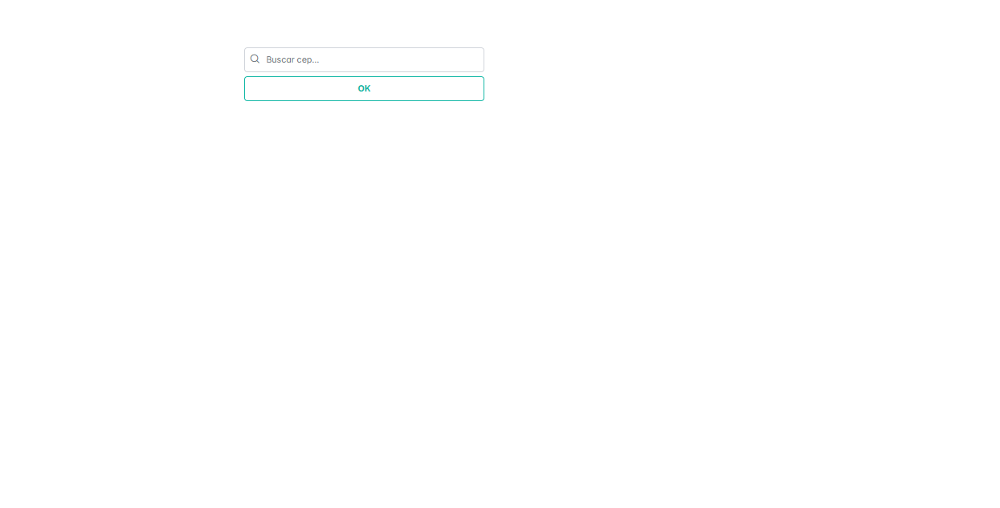
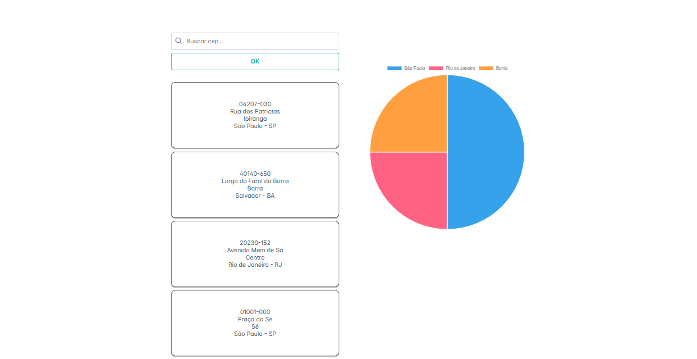

# Sobre o Projeto
Este projeto foi elaborado para a matéria de Programação para Dispositivos Móveis, e se trata de uma aplicação web onde o usuário pode buscar endereços reais informando um CEP.

# Tecnologias
Este projeto utiliza a biblioteca **React**, com o empacotador **Vite**, para criar uma aplicação web leve e rápida. A interface foi construída com componentes do **PrimeReact** e estilizada com **PrimeFlex**. As requisições para busca de CEPs são feitas com a biblioteca **Axios**, utilizando a API pública do [ViaCEP](https://viacep.com.br/) para obter os dados em tempo real.
<table align="center">
    <tr>
        <th></th>
        <th>
        </th>
    </tr>
    <tr>
        <th>
            Linguagens
        </th>
        <td>
            
            
        </td>
    </tr>
    <tr>
        <th>
            Frameworks / Libs
        </th>
        <td>
            
            
            
            
            
        </td>
    </tr>
    <tr>
        <th>
            Editor
        </th>
        <td>
            
        </td>
    </tr>
</table>


# Contribuidores
<a href="https://github.com/pedro-Trovo/busca-cep/graphs/contributors">
  
</a>

# Pré-requisitos
1. Instale o [`Node.js`](https://nodejs.org/en) e certifique-se de que ele inclua o gerenciador de pacotes `npm`.
2. Instale as dependências do projeto com:
```console
npm install
```

# Inicializando o projeto
1. Faça um `git clone` do repositório:
```console
git clone https://github.com/pedro-Trovo/busca-cep
```
2. Acesse a pasta `busca-cep`, abra o CMD e execute o seguinte código:
```console
npm run dev
```
3. Acesse o `localhost` para abrir o site:
```console
http://localhost:5173/
```

<br><br>

# Imagens do Projeto
## Tela Inicial


## Tela de Resultados

